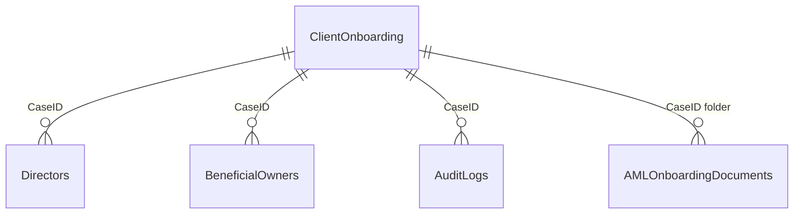

# BDO AML Onboarding — SharePoint Schema

This document defines the SharePoint lists, document library, and columns required to support the **BDO Zimbabwe/Malawi AML/CFT/CPF** onboarding web application (`bdo-aml-app`). It aligns with the [implementation plan](../../implementation_plan.md) and the `OnboardingCase` model in `SharePointService.ts`.

**Target site (example):** `https://bdoportal.sharepoint.com/sites/compliance-onboarding`

---

## Overview

| Artifact | Internal name | Purpose |
| :--- | :--- | :--- |
| Primary list | `ClientOnboarding` | One item per client onboarding case |
| Relational list | `Directors` | Directors / trustees linked to a case |
| Relational list | `BeneficialOwners` | Beneficial owners (≥25% threshold) linked to a case |
| Relational list | `AuditLogs` | Immutable-style workflow audit trail |
| Document library | `AMLOnboardingDocuments` | CDD/EDD files per case folder |



---

## 1. List: `ClientOnboarding`

**Display name:** Client Onboarding  
**Description:** Primary register of AML client onboarding cases and workflow state.

### 1.1 Identification & client profile

| Column display name | Internal name | Type | Required | Notes |
| :--- | :--- | :--- | :---: | :--- |
| Case ID | `Title` | Single line of text | Yes | Unique case reference, e.g. `BDO-AML-2026-0001`. Enforce uniqueness. |
| Client name | `ClientName` | Single line of text | Yes | Legal name or full individual name |
| Client type | `ClientType` | Choice | Yes | See choices below |
| Registration / ID number | `RegNumber` | Single line of text | Yes | Company reg, trust ref, or ID/passport |
| Registered address | `RegisteredAddress` | Multiple lines of text | Yes | Residential or registered address |
| Nature of business | `NatureOfBusiness` | Single line of text | Yes | Industry / occupation |
| Purpose of engagement | `PurposeOfEngagement` | Multiple lines of text | No | Scope of BDO services |
| Contact address | `ContactAddress` | Multiple lines of text | No | Operational / correspondence address |
| Contact email | `ContactEmail` | Single line of text | No | Primary client contact email |
| Contact phone | `ContactPhone` | Single line of text | No | Primary client contact phone |
| Office | `Office` | Choice | Yes | `Zimbabwe` \| `Malawi` |
| Has beneficial owners | `HasBeneficialOwners` | Yes/No | No | True when BO grid applies (≥25% rule) |

**`ClientType` choices**

- `Individual`
- `Legal Person`
- `Legal Arrangement`

**`Office` choices**

- `Zimbabwe`
- `Malawi`

---

### 1.2 Risk assessment (3×3 matrix)

| Column display name | Internal name | Type | Required | Notes |
| :--- | :--- | :--- | :---: | :--- |
| Risk — client | `RiskRatingClient` | Choice | Yes | `Low` \| `Medium` \| `High` |
| Risk — geography | `RiskRatingGeography` | Choice | Yes | `Low` \| `Medium` \| `High` |
| Risk — product / service | `RiskRatingProductService` | Choice | Yes | `Low` \| `Medium` \| `High` |
| Risk — delivery channel | `RiskRatingDeliveryChannel` | Choice | Yes | `Low` \| `Medium` \| `High` |
| Risk — payment mode | `RiskRatingPaymentMode` | Choice | Yes | `Low` \| `Medium` \| `High` |
| Overall risk rating | `OverallRiskRating` | Choice | Yes | Calculated in app; stored on save. `Low` \| `Medium` \| `High` |
| Risk rationale | `RiskRationale` | Multiple lines of text | Yes* | *Required on submit |

---

### 1.3 CDD measures (checklist)

| Column display name | Internal name | Type | Required | Default |
| :--- | :--- | :--- | :---: | :--- |
| Identity verified | `CDDIdentityVerified` | Yes/No | No | No |
| Beneficial ownership verified | `CDDBOVerified` | Yes/No | No | No |
| Nature of business understood | `CDDNatureUnderstood` | Yes/No | No | No |
| PEP screened | `CDDPEPScreened` | Yes/No | No | No |
| Sanctions screened | `CDDSanctionsScreened` | Yes/No | No | No |
| Adverse media screened | `CDDAdverseMediaScreened` | Yes/No | No | No |

---

### 1.4 EDD measures (conditional: Medium/High risk or PEP)

| Column display name | Internal name | Type | Required | Default |
| :--- | :--- | :--- | :---: | :--- |
| Source of funds verified | `EDDSourceOfFundsVerified` | Yes/No | No | No |
| Source of wealth verified | `EDDSourceOfWealthVerified` | Yes/No | No | No |
| Enhanced adverse media | `EDDEnhancedAdverseMedia` | Yes/No | No | No |
| Additional BO verification | `EDDAdditionalBOVerification` | Yes/No | No | No |
| Senior management approved | `EDDSeniorMgmtApproved` | Yes/No | No | No |
| Enhanced monitoring applied | `EDDEnhancedMonitoringApplied` | Yes/No | No | No |
| EDD findings | `EDDFindings` | Multiple lines of text | No | Narrative summary |

---

### 1.5 PEP & screening

| Column display name | Internal name | Type | Required | Notes |
| :--- | :--- | :--- | :---: | :--- |
| Is PEP | `IsPEP` | Yes/No | Yes | Default: No |
| PEP type | `PEPType` | Choice | No | Only if `IsPEP` = Yes |
| Sanctions screened | `SanctionsScreened` | Yes/No | No | Screening completed flag |
| Sanctions match | `SanctionsHasMatch` | Yes/No | No | True if hit |
| Sanctions details | `SanctionsDetails` | Multiple lines of text | No | Match narrative |
| Adverse media — has info | `AdverseMediaHasInfo` | Yes/No | No | |
| Adverse media details | `AdverseMediaDetails` | Multiple lines of text | No | |

**`PEPType` choices**

- `Domestic`
- `Foreign`
- `International`

**Legacy / reporting columns (optional, for Power BI)**

| Column display name | Internal name | Type | Notes |
| :--- | :--- | :--- | :--- |
| Sanctions check (summary) | `SanctionsCheck` | Choice | `Passed` \| `Failed` \| `Flagged` — derived from screening fields |
| Adverse media check (summary) | `AdverseMediaCheck` | Choice | `None` \| `Cleared` \| `Flagged` — derived from screening fields |

---

### 1.6 Final decision & review cycle

| Column display name | Internal name | Type | Required | Notes |
| :--- | :--- | :--- | :---: | :--- |
| Decision | `Decision` | Choice | No | Set at final step |
| Review frequency | `ReviewFrequency` | Choice | No | Set on Engagement Partner approval |
| Next review date | `NextReviewDate` | Date and Time | No | Date only; no time required |

**`Decision` choices**

- `Client accepted`
- `Client accepted subject to conditions/EDD`
- `Client declined`

**`ReviewFrequency` choices**

- `Periodic`
- `Annual`
- `Enhanced and continuous`

---

### 1.7 Electronic signatures

| Column display name | Internal name | Type | Required | Notes |
| :--- | :--- | :--- | :---: | :--- |
| Preparer name | `PreparerSignName` | Single line of text | No | |
| Preparer date | `PreparerSignDate` | Date and Time | No | Date only |
| Preparer signature | `PreparerSignText` | Single line of text | No | Typed signature |
| Compliance name | `ComplianceSignName` | Single line of text | No | |
| Compliance date | `ComplianceSignDate` | Date and Time | No | |
| Compliance signature | `ComplianceSignText` | Single line of text | No | |
| Engagement partner name | `EngagementPartnerSignName` | Single line of text | No | |
| Engagement partner date | `EngagementPartnerSignDate` | Date and Time | No | |
| Engagement partner signature | `EngagementPartnerSignText` | Single line of text | No | |
| Risk partner name | `RiskPartnerSignName` | Single line of text | No | |
| Risk partner date | `RiskPartnerSignDate` | Date and Time | No | |
| Risk partner signature | `RiskPartnerSignText` | Single line of text | No | |

---

### 1.8 Workflow & metadata

| Column display name | Internal name | Type | Required | Notes |
| :--- | :--- | :--- | :---: | :--- |
| Workflow status | `WorkflowStatus` | Choice | Yes | Default: `Draft` |
| Current handler | `CurrentHandler` | Person or Group or Single line of text | No | Active reviewer UPN/email; set on submit and each approval |
| Compliance reviewer email | `ComplianceReviewerEmail` | Single line of text | No | Set by preparer at Step 7 sign-off; first reviewer after submit |
| Engagement partner reviewer email | `EngagementPartnerReviewerEmail` | Single line of text | No | Final approver (or after Risk Partner on high risk / PEP) |
| Risk partner reviewer email | `RiskPartnerReviewerEmail` | Single line of text | No | Used when `OverallRiskRating` = High or `IsPEP` = Yes |
| Date created | `DateCreated` | Date and Time | Yes | Set on create; can mirror `Created` |
| Last updated | `LastUpdated` | Date and Time | Yes | Updated on each save |
| Created by (preparer) | `Created` | Person or Group | Auto | SharePoint system column |
| Modified by | `Modified` | Person or Group | Auto | SharePoint system column |

**`WorkflowStatus` choices**

- `Draft`
- `Pending Compliance`
- `Pending Engagement Partner`
- `Pending Risk Partner`
- `Approved`
- `Returned`
- `Rejected`

---

### 1.9 Optional JSON columns (alternative to flat columns)

If you prefer fewer columns, these app objects can be stored as **Multiple lines of text** (JSON). The app currently uses flat fields in code; flat columns are **recommended** for filtering, views, and Power Automate.

| JSON blob (not recommended for production) | App field |
| :--- | :--- |
| `ContactInfo` | `contactInfo` |
| `RiskRatings` | `riskRatings` |
| `CDDMeasures` | `cddMeasures` |
| `EDDApplied` | `eddApplied` |
| `PEPStatus` | `pepStatus` |
| `Signatures` | `signatures` |

---

## 2. List: `Directors`

**Display name:** Directors & Trustees  
**Description:** Natural persons in governance roles for a client case.

| Column display name | Internal name | Type | Required | Notes |
| :--- | :--- | :--- | :---: | :--- |
| Title | `Title` | Single line of text | No | Optional row label |
| Case | `CaseID` | Lookup | Yes | Lookup to `ClientOnboarding`.`Title` (or ID). **Enforce relationship.** |
| Full name | `FullName` | Single line of text | Yes | |
| Position / role | `Position` | Single line of text | Yes | e.g. Managing Director, Lead Trustee |
| Nationality | `Nationality` | Single line of text | Yes | |
| ID number | `IDNumber` | Single line of text | Yes | Passport / national ID |
| Country of residence | `CountryOfResidence` | Single line of text | Yes | |

**Indexed columns:** `CaseID`

---

## 3. List: `BeneficialOwners`

**Display name:** Beneficial Owners  
**Description:** Natural persons owning or controlling ≥25% (per BDO RBA policy).

| Column display name | Internal name | Type | Required | Notes |
| :--- | :--- | :--- | :---: | :--- |
| Title | `Title` | Single line of text | No | Optional row label |
| Case | `CaseID` | Lookup | Yes | Lookup to `ClientOnboarding` |
| Full name | `FullName` | Single line of text | Yes | |
| Ownership % | `OwnershipPercentage` | Number | Yes | Min 0, max 100; 2 decimal places |
| Basis of control | `BasisOfControl` | Single line of text | Yes | e.g. Direct Shares, Trustee Vote |
| Country | `Country` | Single line of text | Yes | |
| Verification source | `VerificationSource` | Choice | Yes | See choices below |

**`VerificationSource` choices**

- `Company Registry`
- `Trust Deed`
- `Share Register`
- `BO Declaration`
- `Beneficial ownership declaration`
- `Other`

**Indexed columns:** `CaseID`

---

## 4. List: `AuditLogs`

**Display name:** AML Audit Logs  
**Description:** Security and compliance trail for workflow actions (append-only in practice).

| Column display name | Internal name | Type | Required | Notes |
| :--- | :--- | :--- | :---: | :--- |
| Title | `Title` | Single line of text | No | Auto: `{CaseID}-{Timestamp}` |
| Case ID | `CaseID` | Lookup | Yes | Lookup to `ClientOnboarding` |
| Timestamp | `EventTimestamp` | Date and Time | Yes | Include time; store UTC |
| Actor | `Actor` | Single line of text | Yes | User email / UPN |
| Role | `Role` | Single line of text | Yes | e.g. `Preparer`, `Compliance`, `EngagementPartner`, `RiskPartner` |
| Action | `Action` | Choice | Yes | See choices below |
| Comments | `Comments` | Multiple lines of text | No | Required for Return / Reject in app |

**`Action` choices**

- `CREATED`
- `UPDATED`
- `SUBMITTED`
- `APPROVED`
- `RETURNED`
- `REJECTED`
- `DOCUMENT_UPLOADED`

**Indexed columns:** `CaseID`, `EventTimestamp`

**Permissions:** Restrict edit/delete to compliance admins; preparers append via app only.

---

## 5. Document library: `AMLOnboardingDocuments`

**Display name:** AML Onboarding Documents  
**Description:** Case folders and uploaded CDD/EDD evidence.

### 5.1 Folder structure

```
/AMLOnboardingDocuments/
   └── [BDO-AML-2026-0001] Client Name/
         ├── Certificate_of_Incorporation.pdf
         ├── CR6_Directors_Form.pdf
         └── ...
```

Create one folder per `ClientOnboarding.Title` (Case ID) on first upload.

#### How to achieve this (manual, app, or flow)

**A. One-time library setup (SharePoint UI)**

1. On site `compliance-onboarding`, create a **Document library** named `AMLOnboardingDocuments` (internal name must match).
2. Add library columns from [Section 5.2](#52-library-columns-metadata): `CaseID`, `DocumentCategory`, `UploadedBy`, `UploadDate`.
3. Do **not** create case folders manually — the app or flow creates them on first upload.

**B. Folder naming convention**

Use a safe folder name derived from the case:

```
[{CaseID}] {ClientName}
```

Example: `[BDO-AML-2026-0001] Kariba Minerals Pvt Ltd`

Sanitize for SharePoint (remove `\ / : * ? " < > |` and trim length to ~200 characters).

**C. Programmatic flow (what `uploadDocument` should do)**

On each upload, run **two steps** with the user’s Microsoft Graph / SharePoint token:

| Step | Action |
| :--- | :--- |
| 1 | **Ensure folder exists** — if missing, create under library root |
| 2 | **Upload file** into that folder and set metadata (`CaseID`, `DocumentCategory`, etc.) |

**Step 1 — Create folder if it does not exist (SharePoint REST)**

```http
POST https://{tenant}.sharepoint.com/sites/compliance-onboarding/_api/web/folders
Authorization: Bearer {access_token}
Accept: application/json;odata=verbose
Content-Type: application/json;odata=verbose

{
  "__metadata": { "type": "SP.Folder" },
  "ServerRelativeUrl": "/sites/compliance-onboarding/AMLOnboardingDocuments/[BDO-AML-2026-0001] Kariba Minerals Pvt Ltd"
}
```

If the folder already exists, SharePoint returns an error — catch it and continue to upload.

Alternative (add under library root):

```http
POST .../_api/web/GetFolderByServerRelativeUrl('/sites/compliance-onboarding/AMLOnboardingDocuments')/Folders
Body: { "__metadata": { "type": "SP.Folder" }, "ServerRelativeUrl": ".../AMLOnboardingDocuments/{folderName}" }
```

**Step 2 — Upload file into the case folder**

```http
POST https://{tenant}.sharepoint.com/sites/compliance-onboarding/_api/web/GetFolderByServerRelativeUrl('/sites/compliance-onboarding/AMLOnboardingDocuments/{folderName}')/Files/add(url='Certificate_of_Incorporation.pdf',overwrite=true)
Authorization: Bearer {access_token}
Content-Type: application/octet-stream

{binary file bytes}
```

**Step 3 — Set metadata on the uploaded file (list item)**

```http
POST .../_api/web/GetFileByServerRelativeUrl('.../Certificate_of_Incorporation.pdf')/ListItemAllFields
MERGE with:
{
  "CaseID": "BDO-AML-2026-0001",
  "DocumentCategory": "Incorporation_Doc",
  "UploadedBy": "Tendai Moyo"
}
```

**D. Microsoft Graph (recommended for SPA + MSAL)**

Graph is often simpler than classic `_api`:

1. Resolve site → document library drive:  
   `GET /sites/{hostname}:/sites/compliance-onboarding:/lists/AMLOnboardingDocuments/drive`
2. Ensure folder:  
   `PUT /drives/{drive-id}/root:/{folderName}/{fileName}:/content`  
   (Graph creates parent folders automatically when using path-based upload.)
3. Patch item metadata:  
   `PATCH /drives/{drive-id}/items/{item-id}` with `listItem.fields`.

Required delegated permission: **`Files.ReadWrite.All`** or **`Sites.ReadWrite.All`** (plus existing `User.Read`).

**E. Power Automate (no code)**

Trigger: when `ClientOnboarding` item is **created**  
Action: **Create new folder** in `AMLOnboardingDocuments`  
Folder path: `concat('[', Title, '] ', ClientName)`  

Uploads from the app then only upload into the existing folder.

**F. Permissions checklist**

| Requirement | Detail |
| :--- | :--- |
| Azure AD app | Delegated `Files.ReadWrite.All` or `Sites.ReadWrite.All` |
| SharePoint | Preparer group has **Contribute** on `AMLOnboardingDocuments` |
| Token | Use `msalService.getAccessToken()` with SharePoint/Graph scopes (extend `loginRequest.scopes` beyond `User.Read` when going live) |

See `SharePointService.uploadDocument()` — today it **simulates** this path in the console; replace the mock with the REST/Graph calls above when connecting to production.

### 5.2 Library columns (metadata)

| Column display name | Internal name | Type | Required | Notes |
| :--- | :--- | :--- | :---: | :--- |
| Case ID | `CaseID` | Single line of text | Yes | Matches `ClientOnboarding.Title` |
| Document category | `DocumentCategory` | Choice | Yes | See choices below |
| Uploaded by | `UploadedBy` | Single line of text | No | Display name from M365 user |
| Upload date | `UploadDate` | Date and Time | No | Can use `Created` |
| File size (display) | `FileSizeDisplay` | Single line of text | No | e.g. `1.2 MB` — optional |

**`DocumentCategory` choices**

- `ID_Passport`
- `Incorporation_Doc`
- `CR6_Directors`
- `Trust_Deed`
- `BO_Declaration`
- `EDD_Funds_Proof`
- `PEP_Mitigation`

### 5.3 Retention (Microsoft Purview)

| Setting | Value |
| :--- | :--- |
| Retention label | `AML-Client-Retention-5Y` |
| Period | 5 years from end of client relationship |
| Scope | Folder level per case |

---

## 6. Lookup & relationship configuration

| Child list | Lookup column | Parent list | Parent column |
| :--- | :--- | :--- | :--- |
| `Directors` | `CaseID` | `ClientOnboarding` | `Title` |
| `BeneficialOwners` | `CaseID` | `ClientOnboarding` | `Title` |
| `AuditLogs` | `CaseID` | `ClientOnboarding` | `Title` |

Enable **cascade delete** only if business rules allow removing a case and all children together (otherwise disable).

---

## 7. Suggested list views

### `ClientOnboarding`

| View name | Filter |
| :--- | :--- |
| My drafts | `WorkflowStatus` = Draft AND `Created By` = [Me] |
| Pending compliance | `WorkflowStatus` = Pending Compliance |
| Pending engagement partner | `WorkflowStatus` = Pending Engagement Partner |
| Pending risk partner | `WorkflowStatus` = Pending Risk Partner AND `OverallRiskRating` = High |
| Approved clients | `WorkflowStatus` = Approved |
| Malawi office | `Office` = Malawi |
| High risk register | `OverallRiskRating` = High |

### `AuditLogs`

| View name | Filter |
| :--- | :--- |
| By case | `CaseID` = [Parameter] |
| Recent activity | `EventTimestamp` descending, last 30 days |

---

## 8. REST API endpoints (reference)

| Operation | Method | Endpoint |
| :--- | :--- | :--- |
| List cases | GET | `/_api/web/lists/getbytitle('ClientOnboarding')/items?$expand=...` |
| Get case | GET | `/_api/web/lists/getbytitle('ClientOnboarding')/items({id})` |
| Create / update case | POST / MERGE | `/_api/web/lists/getbytitle('ClientOnboarding')/items` |
| Directors | GET/POST | `/_api/web/lists/getbytitle('Directors')/items` |
| Beneficial owners | GET/POST | `/_api/web/lists/getbytitle('BeneficialOwners')/items` |
| Audit logs | POST | `/_api/web/lists/getbytitle('AuditLogs')/items` |
| Upload file | POST | `/_api/web/GetFolderByServerRelativeUrl('.../AMLOnboardingDocuments/{CaseID}')/Files/add` |

**Headers:** `Authorization: Bearer {token}`, `Accept: application/json;odata=verbose` (or `odata=nometadata` for v4).

---

## 9. Column count summary

| List / library | Custom columns (approx.) |
| :--- | ---: |
| `ClientOnboarding` | 58 |
| `Directors` | 6 |
| `BeneficialOwners` | 7 |
| `AuditLogs` | 6 |
| `AMLOnboardingDocuments` | 4 |

---

## 10. Provisioning checklist

- [ ] Create site `compliance-onboarding` (or use existing BDO portal site)
- [ ] Register Azure AD app with `Sites.ReadWrite.All` or scoped SharePoint permissions
- [ ] Create lists in order: `ClientOnboarding` → `Directors` → `BeneficialOwners` → `AuditLogs`
- [ ] Create library `AMLOnboardingDocuments` and add metadata columns
- [ ] Configure lookups and indexed columns
- [ ] Create views per Section 7
- [ ] Apply retention label on document library
- [ ] Configure item-level permissions via Power Automate on status change
- [ ] Add redirect URI and Graph permissions in Azure AD for the SPA
- [ ] Update `.env` with `VITE_SHAREPOINT_SITE_URL` and list names

---

*Generated for `bdo-aml-app` — aligns with `SharePointService.ts` and implementation plan Section 4.*
