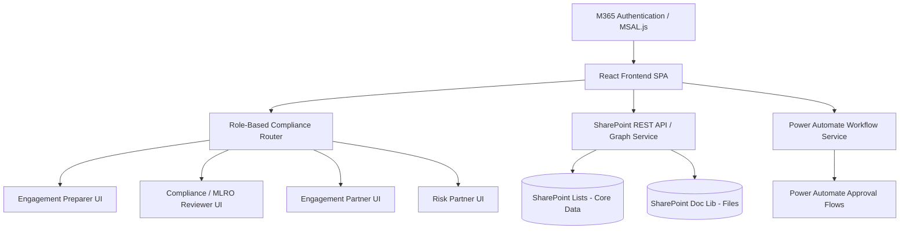
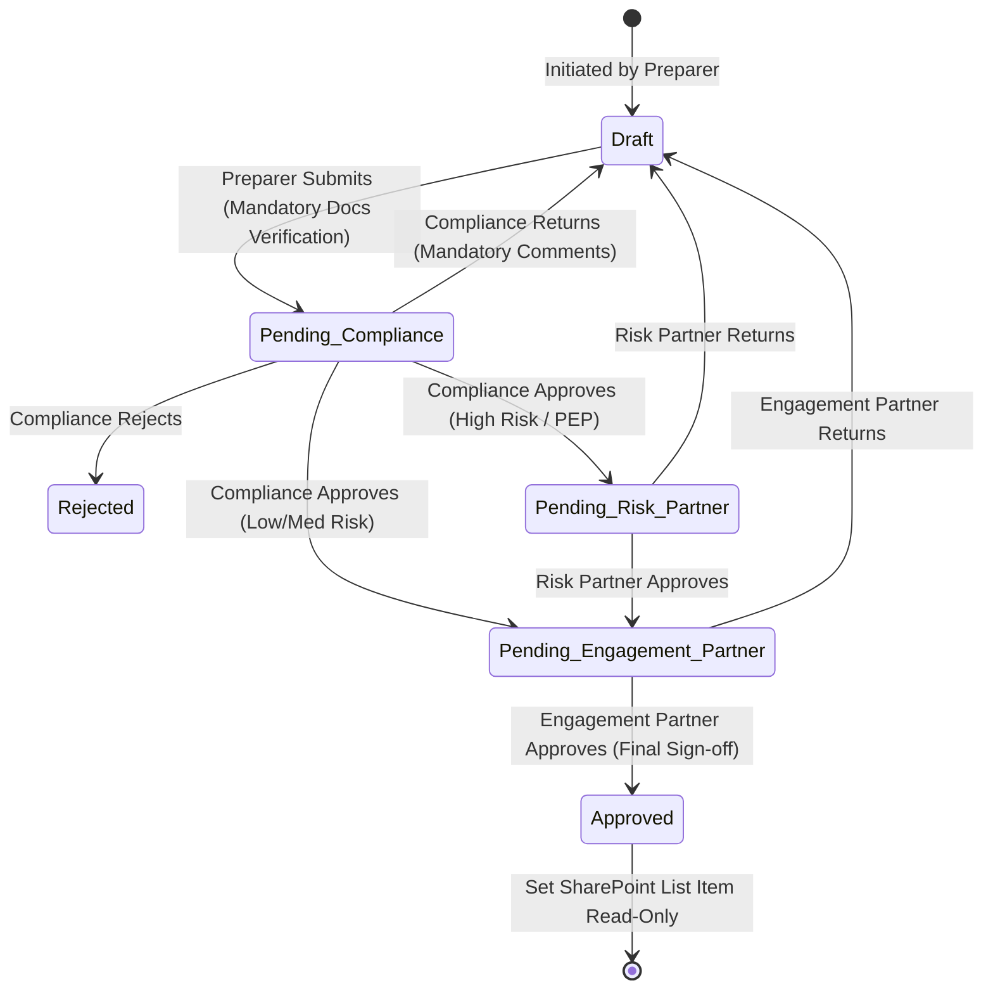

# BDO Zimbabwe/Malawi AML/CFT/CPF Onboarding Web Application

This implementation plan outlines the architecture, data schemas, workflow mappings, and UI components to build a modern, high-fidelity compliance client onboarding application for **BDO Zimbabwe/Malawi**. It translates the BDO Risk-Based Approach (RBA) onboarding document into a premium digital experience with M365 authentication, SharePoint storage, and Power Automate workflows.

> [!NOTE]
> This design aligns directly with the FATF Recommendations (1, 10, 12, 15, 24, 25) and Parts B, C, and E of the BDO Zimbabwe/Malawi AML/CFT/CPF Policy and Procedure Manual.

---

## User Review Required

We have designed a highly detailed technical roadmap. Please review the following key architectural items:
1. **Interactive Demo Mode**: To facilitate seamless testing on any local machine, the application will feature a **Compliance Control Bar**. This allows you to toggle active roles (Preparer, Compliance MLRO, Engagement Partner, Risk Partner), clear local storage databases, and trigger simulated API responses.
2. **Environment Configuration**: We will provide a complete, production-ready `.env.example` containing configuration variables for **MSAL (Microsoft Authentication Library)** and **SharePoint Graph URL** settings.
3. **Vanilla CSS Fluent Styling**: We will build custom, elegant Microsoft Fluent UI styles using CSS variables to handle the transitions between **Light and Dark modes** seamlessly with vibrant compliance styling (e.g., Deep BDO Teal `#008080` for primary, Slate Blue accents, and rich glassmorphic grids).

---

## Open Questions

> [!IMPORTANT]
> **To BDO Zimbabwe/Malawi Compliance & IT Team:**
> 1. **M365 Tenant Scope**: Do your Zimbabwe and Malawi offices share a single Microsoft 365 tenant, or do they operate on separate tenants? (The MSAL config will support single or multi-tenant Azure AD app registration).
> 2. **Beneficial Ownership Threshold**: BDO's document identifies beneficial owners as natural persons owning/controlling **25% or more**. Are there specific legal entity categories in Zimbabwe (e.g., trusts or mining companies) where a lower threshold (e.g., 10%) should be conditionally enforced?
> 3. **Document Retention Duration**: The plan implements a standard 5-year retention period from the date the relationship ends. Does BDO Malawi or Zimbabwe have a local statutory override requiring 6 or 7 years?

---

## Proposed Changes

We will implement the entire application inside the workspace. The structure will be a React + TypeScript SPA powered by Vite.



### 1. Technology & Design Framework
- **Core Framework**: React 19, TypeScript, Vite.
- **Styling System**: Vanilla CSS with modern Fluent UI variables (support for responsive layout, glassmorphic cards, custom animations, hover effects, and automatic Light/Dark mode).
- **Authentication**: `@azure/msal-react` and `@azure/msal-browser` for secure enterprise SSO.
- **Integrations**: Microsoft Graph API for user profiles, SharePoint REST API for list item manipulation, and Power Automate Webhooks for workflow execution.

---

### 2. Multi-Step Onboarding Form Structure
The application implements BDO's onboarding form across 7 cohesive digital steps with **Conditional Logic**:

| Step | Form Section | Description & Conditional Logic |
| :--- | :--- | :--- |
| **Step 1** | **Client Identification** | Basic CDD. Fields adapt dynamically to **Individual**, **Legal Person**, or **Legal Arrangement**. |
| **Step 2** | **Ownership & Control** | Identifies Directors, Trustees, and Beneficial Owners. Triggers a mandatory grid if Beneficial Ownership (BO) percentage is $\ge 25\%$. |
| **Step 3** | **Risk Assessment** | Inherent risk rating across Client, Geography, Product, Delivery Channel, and Payment Mode. **Calculates suggested rating using a 3x3 Risk Matrix**. Rationale text is mandatory. |
| **Step 4** | **CDD Measures** | Verification checklists. Enforces **Mandatory Document Uploads** based on Client Type (e.g., CR6 form required for Legal Persons in Zimbabwe). |
| **Step 5** | **EDD Measures** | **[CONDITIONAL]** Displays **only** if Inherent Risk is **Medium** or **High**, or if **PEP Status** is flagged as "Yes". Enforces Source of Funds and Source of Wealth verification. |
| **Step 6** | **PEP & Screening** | Captures Politically Exposed Person (PEP) status, UNSCR Sanctions Screening outcomes, and Adverse Media findings. |
| **Step 7** | **Final Decision** | Signature pads, acceptance selection, review frequency (Periodic, Annual, or Continuous), and Submit actions. |

---

### 3. Role-Based Permission Model
The system enforces strict compliance barriers at each tier:

| Role | Dashboard Visibility | Onboarding Form Actions | Approval Actions |
| :--- | :--- | :--- | :--- |
| **Preparer** (Engagement Team) | Views own client drafts, rejected submissions, and approval status. | Full Create/Edit capability. Upload documents. | Can only Submit to Compliance. |
| **Compliance / MLRO Reviewer** | Full analytics dashboard, compliance alerts, and all pending cases. | Read-Only. Can view screening alerts and documents. | **Approve** (sends to Engagement Partner), **Return to Preparer**, or **Reject**. |
| **Engagement Partner** | High-level business overview and pending cases requiring sign-off. | Read-Only. Review risk rationale. | **Approve** (Finalizes client if Low/Med; routes to Risk Partner if High-Risk), **Return**, or **Reject**. |
| **Risk Partner** | ONLY views High-Risk cases flagged for senior review. | Read-Only. Review EDD findings. | **Approve** (Final sign-off for High-Risk) or **Return**. |

---

### 4. SharePoint Schema Design

The application stores all data in secure SharePoint lists to leverage out-of-the-box Microsoft compliance, item-level security, and audit trails.

#### `ClientOnboarding` (Primary SharePoint List)
- `Title` (Single line text): Auto-generated unique Case ID (e.g., `BDO-AML-2026-0001`)
- `ClientName` (Single line text): Legal / Full Name
- `ClientType` (Choice): `Individual` | `Legal Person` | `Legal Arrangement`
- `RegNumber` (Single line text): Registration / ID Number
- `NatureOfBusiness` (Single line text): Industry / Occupation
- `RegisteredAddress` (Multiple lines text): Residential / Registered Address
- `ContactInfo` (Multiple lines text): JSON field containing phone, email, and contact person details
- `InherentRiskRating` (Choice): `Low` | `Medium` | `High`
- `OverallRiskRating` (Choice): `Low` | `Medium` | `High`
- `RiskRationale` (Multiple lines text): Mandated narrative explanation of risk drivers
- `WorkflowStatus` (Choice): `Draft` | `Pending Compliance` | `Pending Engagement Partner` | `Pending Risk Partner` | `Approved` | `Returned` | `Rejected`
- `IsPEP` (Boolean): Flag representing PEP status
- `SanctionsCheck` (Choice): `Passed` | `Failed` | `Flagged`
- `AdverseMediaCheck` (Choice): `None` | `Cleared` | `Flagged`
- `ReviewFrequency` (Choice): `Periodic` | `Annual` | `Enhanced & Continuous`
- `NextReviewDate` (Date/Time): Programmatic date set based on risk level
- `CurrentHandler` (Person): Microsoft Graph reference to current reviewer

#### `BeneficialOwners` & `Directors` (Secondary Relational Lists)
- `CaseID` (Lookup to ClientOnboarding): Associates records
- `FullName` (Single line text): Name of natural person
- `Role` (Choice): `Director` | `Trustee` | `Beneficial Owner` | `Senior Management`
- `OwnershipPercentage` (Number): Percentage owned (applicable to Beneficial Owners)
- `Nationality` (Single line text)
- `IDNumber` (Single line text)
- `CountryOfResidence` (Single line text)
- `VerificationSource` (Choice): `Company Registry` | `Trust Deed` | `Share Register` | `BO Declaration` | `Other`

#### `AuditLogs` (Security Trail List)
- `CaseID` (Single line text): References the client record
- `Timestamp` (Date/Time): ISO date of the event
- `Actor` (Single line text): User Principal Name / email
- `Role` (Single line text): Active role during action
- `Action` (Single line text): `CREATED` | `SUBMITTED` | `APPROVED` | `RETURNED` | `REJECTED` | `DOCUMENT_UPLOADED`
- `Comments` (Multiple lines text): Mandated comments for changes and rejections

---

### 5. Document Management & Retention Strategy
Documents are saved inside BDO's **SharePoint Document Library** (`AMLOnboardingDocuments`) utilizing standard compliance policies.

```
/AMLOnboardingDocuments/
   ├── [BDO-AML-2026-0001] Unilever Zimbabwe Limited/
   │     ├── ID_Passport_Directors.pdf
   │     ├── CR6_Directors_Form.pdf
   │     ├── Memo_Articles_Of_Association.pdf
   │     ├── BO_Declaration_Unilever.pdf
   │     └── EDD_SourceOfWealth_Proof.docx
```

- **Category Mapping**: Files uploaded are tagged with metadata column `DocumentCategory` (`ID_Passport` | `Incorporation_Doc` | `CR6_Directors` | `Trust_Deed` | `BO_Declaration` | `EDD_Funds_Proof` | `PEP_Mitigation`).
- **Retention Rules**: 
  - Standard statutory retention in Zimbabwe/Malawi is **5 years** from the formal termination of the client relationship.
  - A retention label (`AML-Client-Retention-5Y`) will be applied to the folder, which triggers a Microsoft Purview review flag before deletion is authorized.

---

### 6. Power Automate Workflow Architecture
When a client is submitted or reviewed, Power Automate handles notifications, status changes, and item-level permissions.



1. **Trigger**: When item is updated in `ClientOnboarding` and status is set to `Pending Compliance`.
2. **Action 1 (Lock Item)**: Power Automate triggers a SharePoint REST API call to break inheritance and set the item as **Read-Only** for the Preparer while granting **Contribute** rights to the Compliance Group.
3. **Action 2 (Compliance Review)**: Sends an Outlook Email & Microsoft Teams adaptive card to the Compliance MLRO group.
4. **Action 3 (Conditional Split - High Risk)**:
   - **Yes (High Risk / PEP)**: Sends an Approval Task to the **Risk Partner** list. Once approved, cascades to the **Engagement Partner**.
   - **No (Low/Medium Risk)**: Cascades directly to the **Engagement Partner**.
5. **Action 4 (Finalize Approval)**: Updates status to `Approved`, stamps electronic signatures, generates a PDF summary in the client's folder, and makes the list item **Read-Only** for everyone except the Senior Compliance Officer.

---

### 7. Implementation Plan Tasks

#### [NEW] [index.css](file:///c:/Users/PatrickSiziba/OneDrive%20-%20BDO%20Zimbabwe/Documents/Audit%20aml/bdo-aml-app/src/index.css)
Contains the Fluent UI style tokens, Light/Dark variables, input components, glassmorphism containers, stepper indicators, and keyframe animations.

#### [NEW] [MSALService.ts](file:///c:/Users/PatrickSiziba/OneDrive%20-%20BDO%20Zimbabwe/Documents/Audit%20aml/bdo-aml-app/src/services/MSALService.ts)
Initializes MSAL.js client, handles SSO authentication, extracts user profiles, and resolves the client's Active Role. Includes an automated Local Storage fallback for local development.

#### [NEW] [SharePointService.ts](file:///c:/Users/PatrickSiziba/OneDrive%20-%20BDO%20Zimbabwe/Documents/Audit%20aml/bdo-aml-app/src/services/SharePointService.ts)
Handles REST calls to fetch/update SharePoint lists, query Graph API, upload files, and trigger Power Automate webhooks. Includes a high-fidelity mock implementation for immediate local execution.

#### [NEW] [App.tsx](file:///c:/Users/PatrickSiziba/OneDrive%20-%20BDO%20Zimbabwe/Documents/Audit%20aml/bdo-aml-app/src/App.tsx)
The main client-side application containing our router, interactive demo control bar, and app layout.

#### [NEW] [Dashboard.tsx](file:///c:/Users/PatrickSiziba/OneDrive%20-%20BDO%20Zimbabwe/Documents/Audit%20aml/bdo-aml-app/src/components/Dashboard.tsx)
The compliance analytical workspace showing active alerts, risk distributions (visual charts), case status metrics, and role-based action queues.

#### [NEW] [OnboardingForm.tsx](file:///c:/Users/PatrickSiziba/OneDrive%20-%20BDO%20Zimbabwe/Documents/Audit%20aml/bdo-aml-app/src/components/OnboardingForm.tsx)
The 7-step digital onboarding form featuring:
- Relational tables for Directors & Beneficial Owners.
- Dynamic matrix for calculating inherent risk.
- Drag-and-drop document upload with category checking.
- Source of Wealth / Funds entries for EDD.
- Full real-time validation checks.

#### [NEW] [WorkflowPanel.tsx](file:///c:/Users/PatrickSiziba/OneDrive%20-%20BDO%20Zimbabwe/Documents/Audit%20aml/bdo-aml-app/src/components/WorkflowPanel.tsx)
Houses the approval timeline, review comment interfaces, electronic signatures, and approval actions.

---

## Verification Plan

### Automated & Manual Verification
- We will construct the application inside a Vite React subfolder (`bdo-aml-app`).
- We will boot the server using `npm run dev` and open a browser window to systematically run through the flow:
  1. **Preparer Path**: Fill in a Legal Person client ("Kudenga Mining Pvt Ltd"), upload dummy incorporation and CR6 documents, perform PEP/Sanctions screening, verify the interactive Risk Matrix outputs, and submit.
  2. **Compliance Reviewer Path**: Switch role to Compliance Reviewer, review the pending item in the queue, inspect the uploaded items, check the PEP flag, and click "Approve" (routing to Risk Partner since Mining triggers a High Inherent Risk).
  3. **Risk Partner Path**: Switch role to Risk Partner, review the EDD measures (source of wealth/funds), and sign off.
  4. **Engagement Partner Path**: Switch role to Engagement Partner, view the comprehensive audit timeline showing all previous signs, and perform the final approval.
  5. **Audit Trail check**: Verify that the generated database and history accurately log all timestamps, remarks, and signatures in a read-only mode after final approval.
